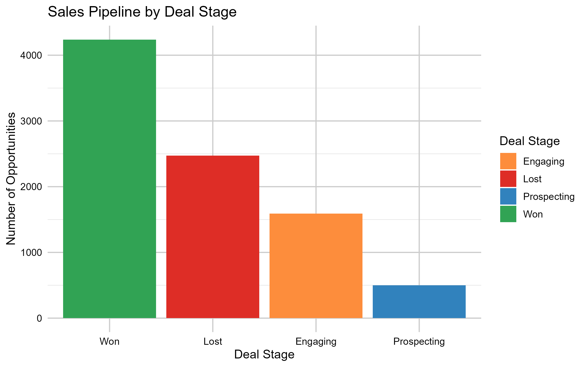
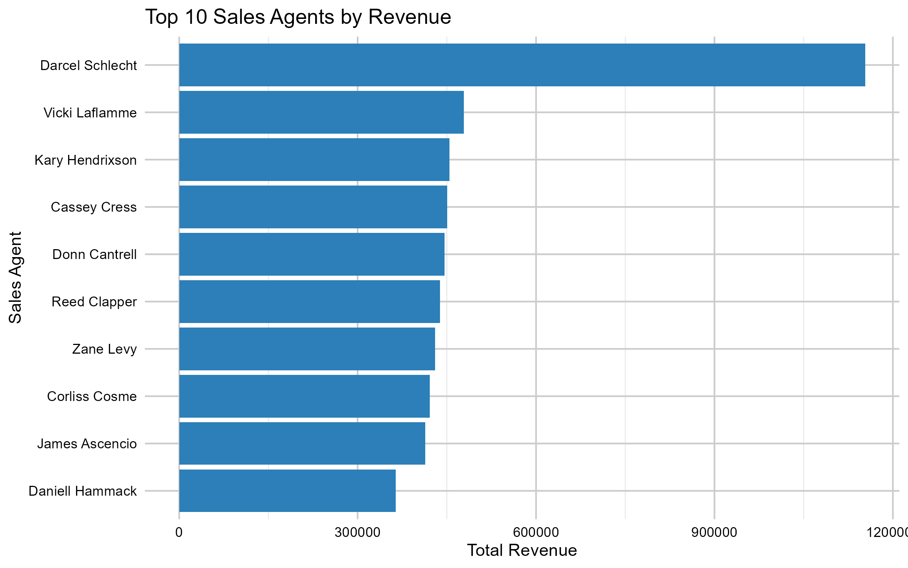
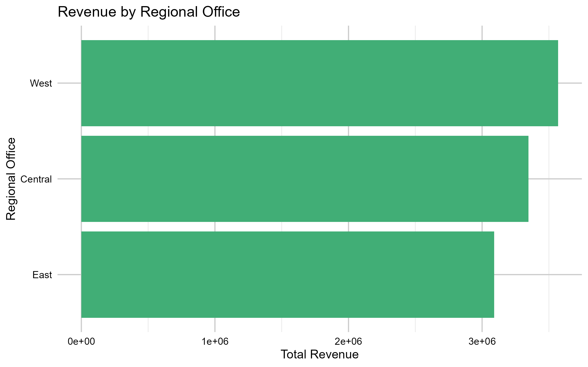
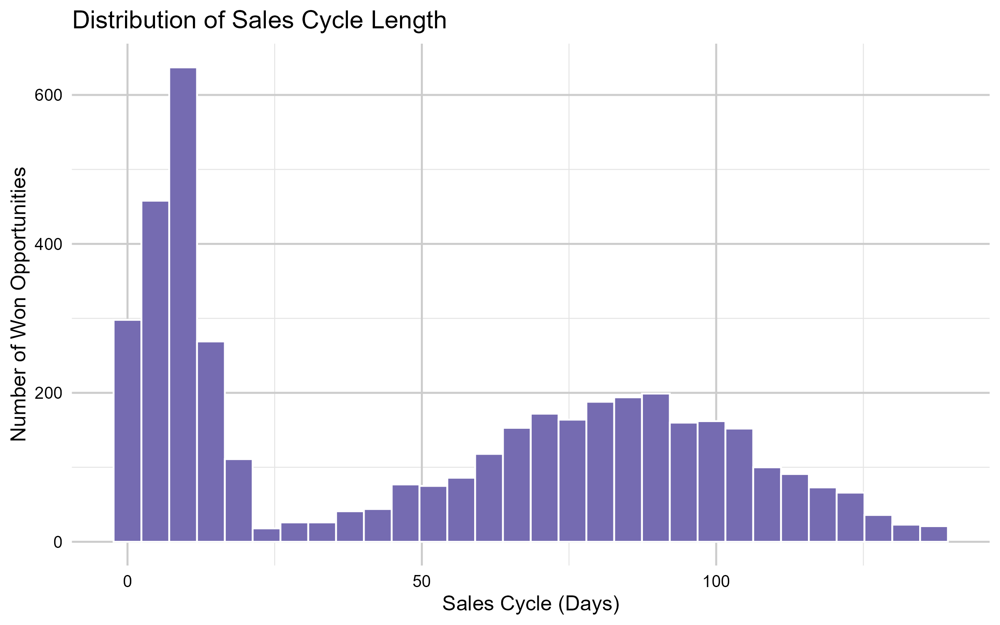
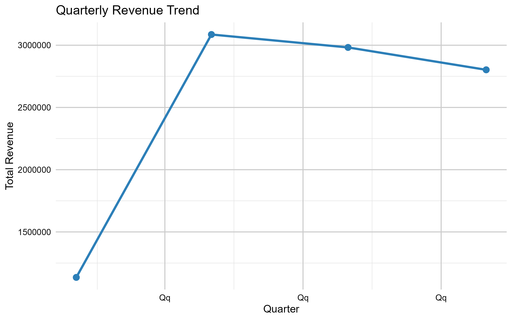
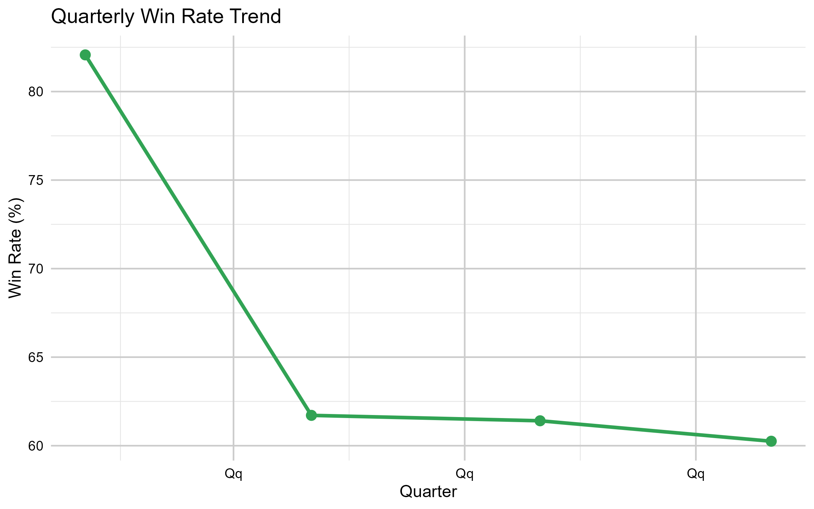
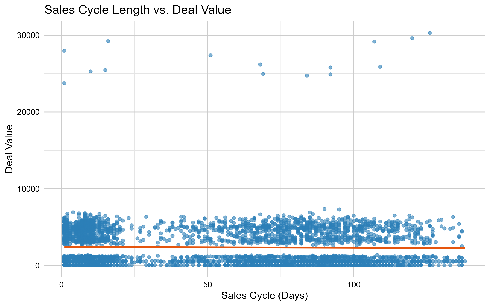
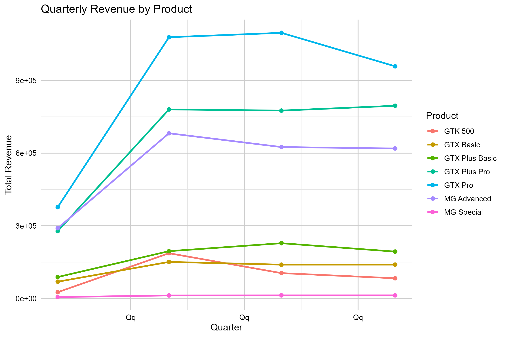

# Sales Performance & Revenue Optimization in R

## Project Overview

This project analyzes B2B sales pipeline data to evaluate sales performance, revenue generation, opportunity conversion, sales-cycle efficiency, and customer account performance.

Using R, the analysis examines sales opportunities across products, sales agents, regional offices, and customer accounts. The goal is to identify sales patterns and performance differences that can support data-driven revenue and sales-management decisions.

The project follows a reproducible analytics workflow covering data import, data-quality assessment, data cleaning, exploratory sales analysis, visualization, and business recommendations.

---

## Business Objective

The objective of this project is to transform raw sales pipeline data into actionable insights that can help a sales organization:

- Evaluate sales pipeline performance
- Measure opportunity conversion and win rates
- Identify high-performing products and sales agents
- Compare regional sales performance
- Understand sales-cycle efficiency
- Examine the relationship between deal value and sales-cycle length
- Identify high-value customer accounts
- Monitor revenue performance over time
- Support data-driven sales and revenue optimization decisions

---

## Business Questions

The analysis addresses the following questions:

1. How are sales opportunities distributed across deal stages?
2. What is the overall sales win rate?
3. Which products generate the most revenue?
4. Which products have the strongest win rates?
5. Which sales agents generate the most revenue?
6. Which sales agents achieve the highest win rates?
7. How does sales performance vary across regional offices?
8. How long does it take to close successful sales opportunities?
9. Is there a relationship between sales-cycle length and deal value?
10. Which customer accounts generate the most revenue?
11. How does revenue performance change across quarters?
12. How does product revenue change across quarters?

---

## Dataset

The project uses the **CRM Sales Opportunities** dataset from Maven Analytics.

Dataset source: [Maven Analytics – CRM Sales Opportunities](https://mavenanalytics.io/data-playground/crm-sales-opportunities)

The dataset represents B2B sales pipeline activity for a fictitious computer hardware company and contains information about sales opportunities, products, customer accounts, sales agents, and regional offices.

### Dataset Tables

| File | Description |
|---|---|
| `accounts.csv` | Customer account information |
| `products.csv` | Product information and sales prices |
| `sales_pipeline.csv` | Sales opportunity and deal-stage information |
| `sales_teams.csv` | Sales agent, manager, and regional information |
| `data_dictionary.csv` | Definitions of dataset variables |

The sales pipeline contains **8,800 sales opportunities**.

### Key Sales Pipeline Variables

- `opportunity_id`
- `sales_agent`
- `product`
- `account`
- `deal_stage`
- `engage_date`
- `close_date`
- `close_value`

---

## Data Preparation

The datasets were assessed and prepared before conducting the sales analysis.

### Data Quality Assessment

The following checks were performed:

- Missing-value assessment
- Duplicate-record detection
- Data-type validation
- Categorical-value validation
- Date consistency checks
- Sales-value range checks
- Opportunity ID uniqueness checks
- Cross-table validation of products, accounts, and sales agents

### Data Cleaning

Several data-quality issues were identified and standardized:

- `technolgy` → `technology`
- `Philipines` → `Philippines`
- `GTXPro` → `GTX Pro`

Missing account information was preserved rather than deleting affected opportunities. An `account_missing` indicator was created, and missing account names were represented as `Unknown Account` for general analysis.

An `is_closed` indicator was also created to distinguish closed opportunities from open opportunities.

Missing `close_date` and `close_value` values for open opportunities were retained because these values are not expected to be available until an opportunity is closed.

The original raw datasets were not modified. Cleaned datasets were saved separately in the `outputs/` directory.

---

## Sales Analysis

### Pipeline Performance

The sales pipeline was analyzed across four deal stages:

- Prospecting
- Engaging
- Won
- Lost

The final pipeline contained:

| Deal Stage | Opportunities | Share |
|---|---:|---:|
| Won | 4,238 | 48.2% |
| Lost | 2,473 | 28.1% |
| Engaging | 1,589 | 18.1% |
| Prospecting | 500 | 5.7% |

Overall, **4,238 of 8,800 opportunities were won**, while 2,473 were lost.

### Win Rate

Overall win rate was calculated using closed opportunities only:

**Win Rate = Won Opportunities / Closed Opportunities × 100**

Open opportunities in Prospecting and Engaging were not treated as losses.

Win rates were also analyzed by:

- Product
- Sales agent
- Quarter

### Revenue Performance

Revenue analysis focused on won opportunities and included:

- Total revenue
- Average deal value
- Median deal value
- Product revenue
- Sales-agent revenue
- Regional revenue
- Account revenue
- Quarterly revenue

### Product Performance

Products were evaluated using revenue, number of won opportunities, average deal value, and median deal value.

The highest revenue-generating product was **GTX Pro**, with:

- **729 won opportunities**
- **$3,510,578 total revenue**
- **$4,816 average deal value**
- **$4,828 median deal value**

Although GTX Pro generated the highest total revenue, **GTK 500 had the highest average deal value at approximately $26,707**, based on only 15 won opportunities. This highlights why both revenue and deal volume should be considered when evaluating product performance.

### Sales Agent Performance

Sales agents were evaluated using:

- Total opportunities
- Closed opportunities
- Won opportunities
- Lost opportunities
- Total revenue
- Win rate

Win-rate comparisons were restricted to agents with at least **50 closed opportunities** to reduce the influence of very small samples.

Among the agents shown in the top results, **Hayden Neloms** had the highest win rate at approximately **70.4%**, followed closely by **Maureen Marcano at 70.0%**.

### Account Performance

Customer accounts were evaluated based on:

- Total revenue
- Won opportunities
- Average deal value

The top revenue-generating account was **Kan-code**, with:

- **115 won opportunities**
- **$341,455 total revenue**
- Approximately **$2,969 average deal value**

Other high-revenue accounts included Konex, Condax, Cheers, and Hottechi.

### Sales-Cycle Efficiency

Sales-cycle length was calculated for won opportunities using the difference between engagement date and close date.

Among **4,238 won opportunities**:

- Average sales cycle: **51.8 days**
- Median sales cycle: **57 days**
- Minimum sales cycle: **1 day**
- Maximum sales cycle: **138 days**

The project also examines the relationship between sales-cycle length and deal value using a scatter plot and linear trend line.

### Quarterly Performance

Quarterly revenue performance showed:

| Quarter | Won Opportunities | Revenue | Average Deal |
|---|---:|---:|---:|
| Q1 2017 | 531 | $1,134,672 | $2,137 |
| Q2 2017 | 1,254 | $3,086,111 | $2,461 |
| Q3 2017 | 1,257 | $2,982,255 | $2,373 |
| Q4 2017 | 1,196 | $2,802,496 | $2,343 |

Q2 generated the highest quarterly revenue at approximately **$3.09 million**.

Quarterly win rates were:

| Quarter | Closed Opportunities | Win Rate |
|---|---:|---:|
| Q1 2017 | 647 | 82.1% |
| Q2 2017 | 2,032 | 61.7% |
| Q3 2017 | 2,047 | 61.4% |
| Q4 2017 | 1,985 | 60.3% |

The unusually high Q1 win rate should be interpreted alongside its smaller number of closed opportunities.

---

## Key Business Insights

### 1. Won opportunities represent the largest pipeline outcome

Won opportunities account for **48.2% of all opportunities**, compared with 28.1% classified as Lost.

This indicates a substantial proportion of the recorded pipeline resulted in successful sales.

### 2. GTX Pro is the strongest revenue-generating product

GTX Pro generated approximately **$3.51 million in revenue**, making it the largest contributor among the seven products analyzed.

### 3. Revenue and deal value tell different stories

GTX Pro generated the highest total revenue, while GTK 500 had a much higher average deal value.

However, GTK 500 had only **15 won opportunities**, meaning its high average deal value should be interpreted with caution.

### 4. Sales-cycle length varies considerably

Successful opportunities ranged from **1 to 138 days**, with an average of **51.8 days**.

This suggests meaningful variation in how quickly opportunities move from engagement to successful close.

### 5. Sales performance varies across agents

The analysis shows differences in both revenue generation and win rate across sales agents.

Evaluating both metrics provides a more complete picture of sales performance than relying on either metric alone.

### 6. Quarterly revenue peaked in Q2 2017

Revenue increased substantially from Q1 to Q2, reaching approximately **$3.09 million**, before declining slightly in Q3 and Q4.

---

## Business Recommendations

### Prioritize high-performing products

Products generating strong revenue should receive continued sales attention, while product-level win rates should also be considered when allocating sales resources.

### Use both revenue and win rate to evaluate sales agents

Revenue identifies agents generating high sales value, while win rate provides insight into conversion effectiveness. Sales managers should consider both measures when evaluating performance.

### Investigate sales-cycle variation

Opportunities with longer sales cycles should be reviewed to identify potential bottlenecks in the sales process.

### Focus on high-value customer accounts

High-revenue accounts can be prioritized for account-management and retention strategies.

### Monitor quarterly performance

Quarterly revenue and win-rate trends can support sales planning, resource allocation, and performance monitoring.

### Avoid relying on a single sales metric

The analysis demonstrates that revenue, win rate, deal value, opportunity volume, and sales-cycle length provide different perspectives on sales performance. A combination of metrics provides a more complete basis for decision-making.

---

## Visualizations

### Sales Pipeline by Deal Stage



### Top 10 Sales Agents by Revenue



### Revenue by Regional Office



### Sales Cycle Distribution



### Quarterly Revenue Trend



### Quarterly Win Rate Trend



### Sales Cycle Length vs. Deal Value



### Quarterly Revenue by Product



---

## Project Structure

```text
sales-performance-revenue-optimization-r/
│
├── README.md
├── Sales_Performance_R.Rproj
│
├── Data/
│   ├── accounts.csv
│   ├── data_dictionary.csv
│   ├── products.csv
│   ├── sales_pipeline.csv
│   └── sales_teams.csv
│
├── R/
│   ├── 01_data_import.R
│   ├── 02_data_quality.R
│   ├── 03_data_cleaning.R
│   └── 04_sales_analysis.R
│
├── outputs/
│   ├── accounts_clean.csv
│   ├── products_clean.csv
│   ├── sales_pipeline_clean.csv
│   ├── sales_teams_clean.csv
│   ├── opportunity_summary.csv
│   ├── win_rate.csv
│   ├── revenue_summary.csv
│   ├── product_win_rate.csv
│   ├── product_performance.csv
│   ├── sales_agent_performance.csv
│   ├── agent_win_rate.csv
│   ├── regional_performance.csv
│   ├── account_performance.csv
│   ├── top_account_performance.csv
│   ├── sales_cycle_summary.csv
│   ├── sales_cycle_value.csv
│   ├── quarterly_performance.csv
│   ├── quarterly_win_rate.csv
│   ├── product_quarterly_revenue.csv
│   └── pipeline_funnel.csv
│
└── Figures/
    ├── sales_pipeline_by_stage.png
    ├── top_10_sales_agents_revenue.png
    ├── revenue_by_regional_office.png
    ├── sales_cycle_distribution.png
    ├── quarterly_revenue_trend.png
    ├── quarterly_win_rate_trend.png
    ├── sales_cycle_vs_deal_value.png
    └── quarterly_revenue_by_product.png
```
---

## Tools & Technologies

- **R**
- **RStudio**
- **tidyverse**
- **dplyr**
- **ggplot2**
- **readr**
- **lubridate**
- **Git**
- **GitHub**

---


## Conclusion

This analysis demonstrates how B2B sales pipeline data can be transformed into actionable insights using R. The analysis evaluated sales opportunities across deal stages, products, sales agents, regional offices, customer accounts, sales cycles, and quarterly performance.

The results show that **GTX Pro generated the highest total revenue among the products analyzed**, while sales performance varied across agents and customer accounts. The analysis also identified substantial variation in sales-cycle length and showed that quarterly revenue and win rates can provide useful perspectives for monitoring sales performance.

Overall, the project demonstrates the importance of using multiple sales metrics rather than relying on a single measure. Combining revenue, win rate, opportunity volume, deal value, sales-cycle length, and account performance provides a more complete view of sales effectiveness and can support better decisions around sales strategy, resource allocation, and revenue optimization.

---

## Author

**Kadian Hutchinson**

Data Analytics | Sales Analytics | Business Intelligence
